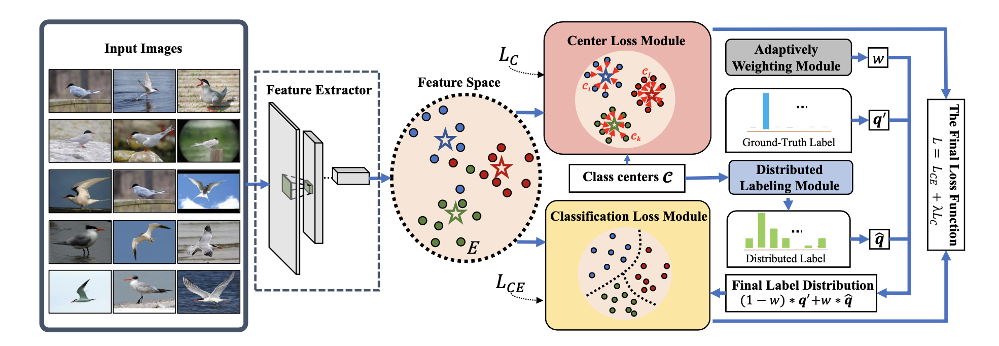
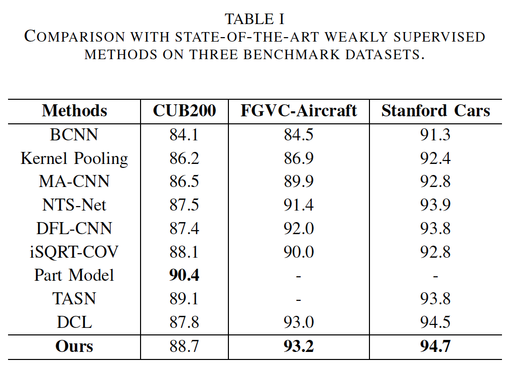
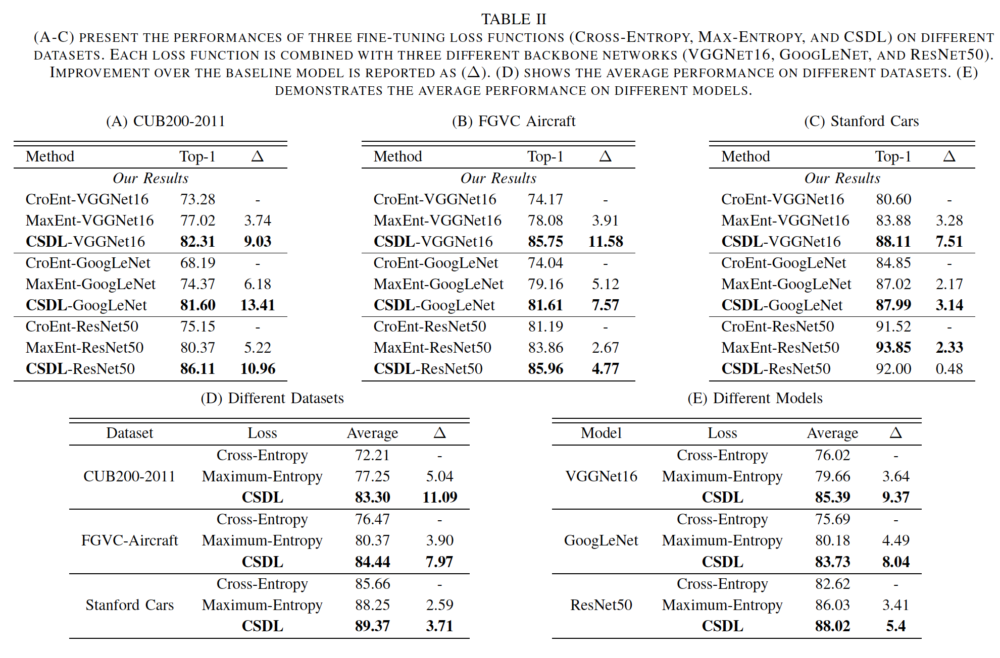

Introduction
------------
The is the source code for our paper **Exploiting Category Similarity based Distributed Labeling for Fine-Grained Visual Classification**

Network Architecture
--------------------
The architecture of our proposed CSDL model is as follows


Performance
-----------



Installation
------------
After creating a virtual environment of python 3.5, run `pip install -r requirements.txt` to install all dependencies

How to use
----------
The code is currently only tested on GPU
* **Data Preparation**
    
    Download data into CSDL root directory and uncompress them using
    ```
    wget https://plr.oss-cn-hongkong.aliyuncs.com/aircraft.tar.gz
    wget https://plr.oss-cn-hongkong.aliyuncs.com/cub200.tar.gz
    wget https://plr.oss-cn-hongkong.aliyuncs.com/cars.tar.gz
    tar -xvf aircraft.tar.gz
    tar -xvf cub200.tar.gz
    tar -xvf cars.tar.gz
    ```
    Or you can download CUB200-2011 / FGVC-Aircraft / Stanford Cars dataset from its official website and split them into the following structure
    ```
    - train
        |-- class1
              |----- train image1
              |----- train image2
              |----- ...
        |-- class2
              |----- train image1
              |----- train image2
              |----- ...
        |-- ...
    - val
        |-- class1
              |----- test image1
              |----- test image2
              |----- ...
        |-- class2
              |----- test image1
              |----- test image2
              |----- ...
        |-- ...
    ```
    
* **Demo**
    - If you just want to do a quick test on the model and check fine-grained classification performance, please
        - Prepare data as instructed above
        - Download one of the following trained models into `model/` using
            ```
            wget https://plr.oss-cn-hongkong.aliyuncs.com/aircraft-vgg16-best_epoch-85.75.pth
            wget https://plr.oss-cn-hongkong.aliyuncs.com/aircraft-googlenet-best_epoch-81.61.pth
            wget https://plr.oss-cn-hongkong.aliyuncs.com/aircraft-resnet50-best_epoch-85.96.pth
            wget https://plr.oss-cn-hongkong.aliyuncs.com/cub200-vgg16-best_epoch-82.31.pth
            wget https://plr.oss-cn-hongkong.aliyuncs.com/cub200-googlenet-best_epoch-81.60.pth
            wget https://plr.oss-cn-hongkong.aliyuncs.com/cub200-resnet50-best_epoch-86.11.pth
            wget https://plr.oss-cn-hongkong.aliyuncs.com/cars-vgg16-best_epoch-88.11.pth
            wget https://plr.oss-cn-hongkong.aliyuncs.com/cars-googlenet-best_epoch-87.99.pth
            wget https://plr.oss-cn-hongkong.aliyuncs.com/cars-resnet50-best_epoch-92.00.pth
            ```
        - Activate virtual environment (e.g. conda)
        - Modify `CUDA_VISIBLE_DEVICES` to proper cuda device id in `demo.sh` 
        - Modify `NET` to corresponding base network based on the model downloaded in `demo.sh` 
        - Modify `DATA_BASE` and `N_CLASSES` properly based on the dataset in `demo.sh` (the dataset option includes CUB200-2011, FGVC-Aircraft, Stanford Cars, CIFAR10 and CIFAR100)
        - Modify the `MODEL` in `demo.sh` according to the model downloaded.
        - Run demo using `bash demo.sh`
        
* **Source code**
    - If you want to train the whole network from beginning using source code, please
        - Prepare data as instructed above
        - Activate virtual environment(e.g. conda) 
        - Modify `CUDA_VISIBLE_DEVICES` to proper cuda device id in `run.sh`
        - Run training using `bash run.sh`


* **CSDL-iSQRT-COV**
    - if you want to test the combination between our CSDL and iSQRT-COV, check the `CSDL-iSQRT-COV` folder.